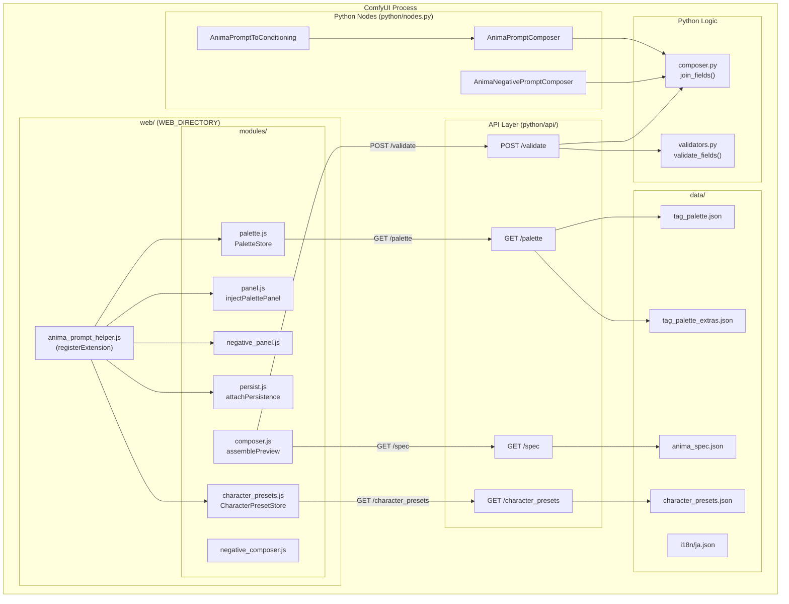
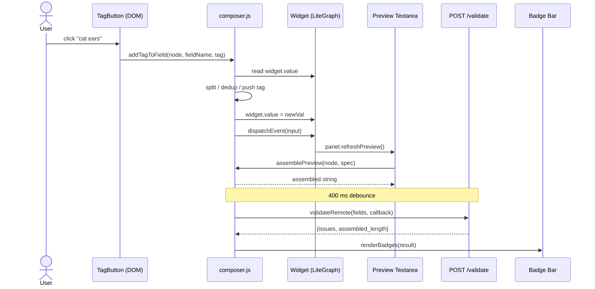
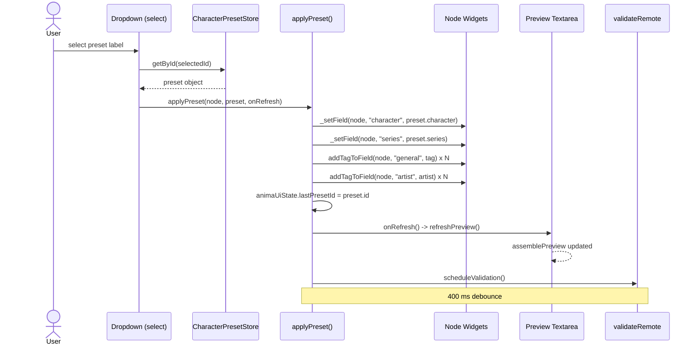
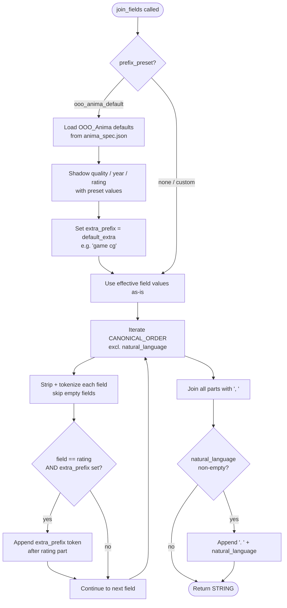
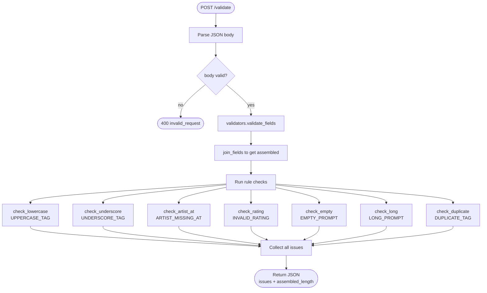
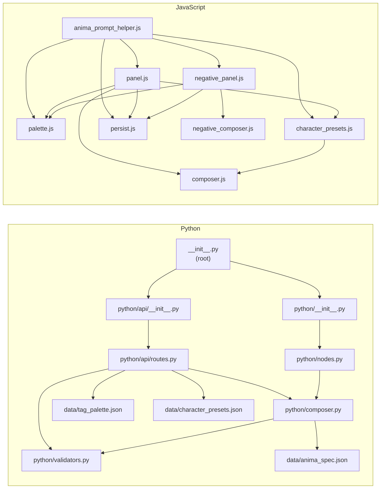
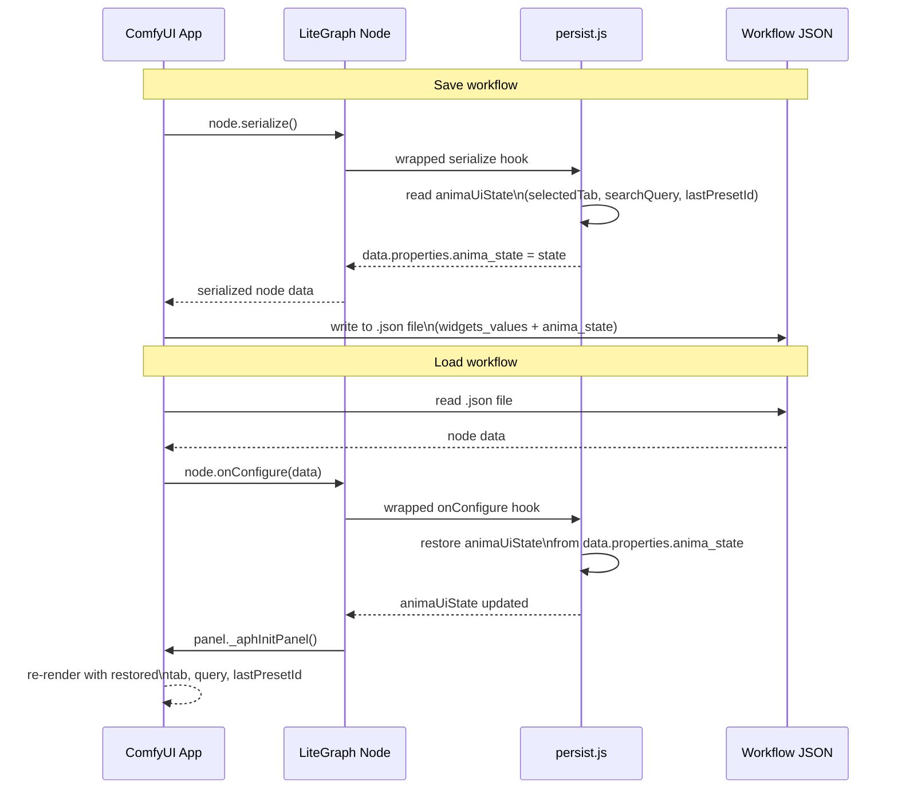
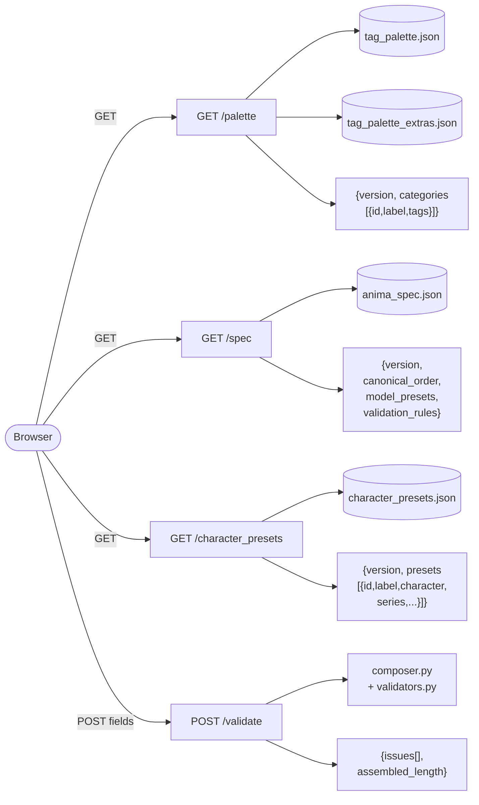

# anima-prompt-helper — Architecture Diagrams

Visual reference for contributors. All diagrams are Mermaid-formatted and
render natively in GitHub's markdown viewer. Cross-references use relative
paths (e.g. `../DESIGN.md`, `../api_contract.md`).

See also: [`../DESIGN.md`](../DESIGN.md) · [`../api_contract.md`](../api_contract.md) · [`../MODULE_TREE.md`](../MODULE_TREE.md)

---

## Diagram 1: System Overview

Top-level map of the entire extension. Shows how Python nodes, API routes,
JavaScript modules, and data files are wired together inside the ComfyUI
process.

---

## Diagram 2: Tag Palette Click Flow

Runtime sequence when a user clicks a tag button in the palette panel. Shows
the full event chain including the 400 ms debounce before remote validation.

---

## Diagram 3: Character Preset Apply Flow

Sequence when a user selects an entry from the character preset dropdown.
Shows how the preset data populates multiple field widgets and triggers a
preview refresh.

---

## Diagram 4: Backend Compose Logic

Internal control flow of `join_fields()` in `composer.py`. Illustrates how
the `prefix_preset` parameter branches the assembly path before fields are
tokenized and joined.

---

## Diagram 5: Validation Pipeline

Control flow through the POST `/validate` route and all seven rule checks.
Each check is independent; results are collected and returned as a single
issues array.

---

## Diagram 6: Module Dependency Graph

Static import relationships across all Python and JavaScript modules. Use
this diagram to trace where a change in one file may require updates
elsewhere.

---

## Diagram 7: State Persistence

Sequence covering a full save-and-reload cycle of a ComfyUI workflow. Shows
how `anima_state` is injected into the serialized node JSON and then restored
when the workflow is reopened.

---

## Diagram 8: HTTP Routes

All four routes served by `python/api/routes.py`, the data sources each
reads, and the shape of the response returned to the browser.

---

## Reading Guide

| Diagram | Purpose |
|---------|---------|
| **1 — System Overview** | Top-level map; start here to orient yourself |
| **2 — Tag Click Flow** | Runtime sequence when a user adds a tag |
| **3 — Character Preset Flow** | Runtime sequence when a preset is applied |
| **7 — State Persistence** | Runtime sequence for save/load round-trip |
| **4 — Compose Logic** | Internal Python assembly logic (`composer.py`) |
| **5 — Validation Pipeline** | Internal Python validation logic (`validators.py`) |
| **6 — Module Dependencies** | Static import graph; use for refactoring impact analysis |
| **8 — HTTP Routes** | Route-to-data-file mapping and response shapes |

**How the diagrams relate:**
Diagram 1 is the top-level map of the whole system.
Diagrams 2, 3, and 7 are runtime event flows — read them when tracing a
specific user action through the code.
Diagrams 4 and 5 drill into backend Python logic that has no JS equivalent.
Diagrams 6 and 8 are static structural references useful during refactoring
or when adding a new module or route.
